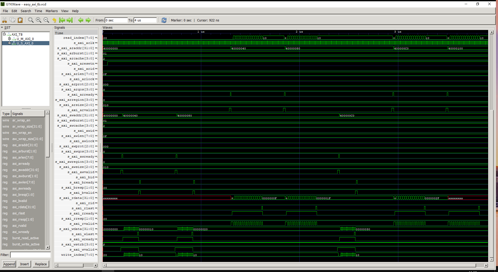

## **AXI总线**
AXI总线是ARM公司提供的片内高速通信协议，目前已经发展到第五代(2020年)，在各种数字芯片中有着广泛应用，因此抽寒假时间进行了解并且实操仿真，为将来的秋招做准备。
目的：```学习记录+FPGA/IC知识备份```    
参考资料：
- [IHI0022E_amba_axi_and_ace_protocol_spec.pdf](https://developer.arm.com/documentation/ihi0022/e)    
- [IHI0022H_amba_axi_and_ace_protocol_spec.pdf](https://developer.arm.com/documentation/ihi0022/h)
- [bilibili-FPGA奇哥](https://space.bilibili.com/497026889)
- https://github.com/RongyeL/easy_axi
- [各种技术博客1](https://cloud.tencent.com/developer/article/1661238)
- [各种技术博客2](https://zhuanlan.zhihu.com/p/44766356)

### **0. 写在前面**

仿真使用轻量级仿真软件iverilog+gtkwave，安装好上述环境后，切换到sim路径下，git/cmd窗口输入make，makefile自动执行并打开波形文件，如图所示

<div align=center>

</div>    

### **1.1 协议特点**

- 分离的地址/控制、数据相位
- 使用字节选通，支持非对齐的数据传输
- 基于burst传输，只需传输首地址
- 读、写数据通道分离，能提供低功耗DMA
- 支持多种寻址方式
- 支持乱序传输(out of order)
- 易于添加寄存器级来进行时序收敛
- 支持outstanding AXI(连续发送多个地址，统一进行突发传输，有助于流水处理)


### **1.2 读写架构**

AXI协议是基于burst的传输，并且定义了以下5个独立的传输通道：
- 读地址通道
- 读数据通道
- 写地址通道
- 写数据通道
- 写响应通道


AXI使用基于**VALID/READY**的握手机制数据传输协议，传输源端使用VALID表明地址/控制信号、数据有效，目的端使用READY表明自己能够接受信息。

VALID和READY的先后关系具有三种情况：

- VALID先有效，等待READY有效后完成传输（VALID一旦有效后在传输完成前不可取消）
- READY先有效，等待VALID有效后完成传输（READY可以在VALID有效前撤销）
- VALID和READY同时有效，立刻完成传输

一些有意思的**特点**：   
1. 发送方拥有传输的主动权，但接收方在不具备接收能力时，也能够置低信号VALID停止传输，反压发送方 
2. 双向流控机制，指的是发送方通过置起 VALID 信号控制发送的时机与速度，接收方也可以通过 READY 信号的置起与否控制接收速度**
3. READY可以默认为高，也可以是低。READY刚开始置高的原因是时序要求，设置为高会直接节省一个周期。


### **2.1 传输顺序**
- 写
  - AW通道握手，发送写入地址（主机发起）
  - W通道握手，传输写入数据（主机发起）
  - B通道握手，标志数据写入完成（从机发起）
- 读
  - AR通道握手，发送读取地址（主机发起）
  - R通道握手，传输读出数据和RESP数据（主机发起）


### **2.2 关键信号**

信号可以分为三类，一类在每次传输时需要主从机的逻辑进行控制，其他两类信号往往定义为常值。本文将前者定义为关键信号，包括：
- VALID & READY (握手信号)
- ID & ADDR
- LAST
- DATA
- BRESP & RRESP

### **2.3 属性信号**

属性信号指定了突发传输类型，每次传输transaction(burst)中transfer(beat)的次数及数据大小
- AxBURST
  - FIXED（AxBURST[1:0]=0b00）：固定模式，每次突发传输的地址相同,用于FIFO访问
  - INCR（AxBURST[1:0]=0b01）：增量模式，突发传输地址递增，递增量与突发尺寸相关（传输过程中，地址递增。增加量取决AxSIZE的值。
  - WRAP（AxBURST[1:0]=0b10）：回卷模式，和增量类似，但会在特定高地址的边界处回到低地址处（传输地址不会超出起始地址所在的块，一旦递增超出，则回到该块的起始地址），突发传输地址可溢出性递增，突发长度仅支持2,4,8,16。Cache中常常会用到。 


- AxLEN   
突发长度为每次突发传输的传输次数，每次传输的突发长度为AxLEN[3:0] + 1（AXI增量模式AxLEN[7:0] + 1），AXI3只支持1~16次的突发传输（Burst_length=AxLEN[3:0]+1）AXI4扩展突发长度支持INCR突发类型为1~256次传输，对于其他的传输类型依然保持1~16次突发传输（Burst_Length=AxLEN[7:0]+1），对于回卷模式突发传输，突发长度仅能是2,4,8或16。

- AxSIZE   
突发尺寸为每次传输的byte数量。每次的突发尺寸不能超过数据通道的宽度；若突发尺寸小于数据通道宽度，需要指定哪些位数是有效的。突发尺寸为2^AxSIZE[2:0]

### **2.4 特点信号**

特点信号是
- AxCACHE
- AxPROT
- AxQOS 
- AxUSER
- AxLOCK


### **3.1 三板斧**
- outstanding
  - 当一个slave连续收到多个AWID/WID不同的transaction，而slave返回BRESP时其BID与master发出的AWID/WID不同，则称为写乱序
  - 乱序机制主要针对的是slave端，而与master的行为无关
- out of order
- interleaving

#### 无需保序的情况
- 不同master发出的transaction之间没有保序要求。
- 不同ID的transaction之间没有保序要求。
- AWID与ARID相同的transaction之间没有保序要求。
#### 必须保序的情况
同一ARID的read transfer间需与address发出的顺序一致。
同一AWID的write transfer间需与address发出的顺序一致。
同一master发出的同一ID的transaction可能访问不同的slave，返回的RDATA或BRESP需

### **3.2 死锁的几种情况**

1. 【单主机单从机】允许READY信号等待VALID信号，但不允许VALID信号等待READY信号，否则双向等待，产生死锁。**总而言之，发起传输（提供VALID信号）必须是完全主动和独立的行为，不能依赖于对方READY**
2. 【单主机多从机】
3. 【多主机多从机】


### **3.3 4K问题**

- 说明：一次突发传输的地址范围不能跨越4KB。所谓的4K边界是指低12bit为0的地址，例如32’h00001000, 32’h00002000… 这些特殊的地址我们称之为4k边界；同理1k边界是指低10bit为0的地址。  
- 目的：防止突发跨越两个从机的边界，也限制了从机所需支持的地址自增数。   
- 原因：系统中定义一个page大小是4K。所以，为了更好的设定每个slave的访问attribue，就给一个slave划分4K空间

- 若跨越4k边界的办法：**拆分**。例如处理器load多个数据，就是跨页访问，到了接口控制模块，也会把这一个访问拆分成两个访问。例如，core要访问0x1FF0-0x200C共32byte的数据，每次beat为4B，系统会自动给拆分成0x1FF0-0x1FFF和0x2000-0x200C两个transaction。


### **AXI4和AXI3区别**
- 信号区别
  - Burst Length
    - AXI3 AxLen: 4 bits, maximum 16 beats
    - AXI4 AxLen: 8 bits, maximum 256 beats
    - Only INCR burst mode supported beats more than 16
    - Exclusive Access burst length less than 16

  - QoS Signals
    - AXI4 new feature
    - 4 bits signal indicates signal priority

  - Region Signals
    - AIX4 new feature
    - region identifier, replace high-bit address to divide different region

  - User Signals
    - AW, AR, W, R, B
    - not recommended in AMBA4, always used to transfer sideband

  - WID
    - AXI4 cancels support of write-interleaving due to complexity and deadlock
    - W follow AW transaction order

  - AxCache Update
    - massive changes, look up datasheet for detail

  - Lock Support
    - AXI3: 2 bits
    - AXI4: 1 bit
    - remove locked transaction support in AXI4, which can potentially cause system breakdown

  - Write Response
    - AXI3: WVALID, WREADY, WLAST
    - AXI4: AWVALID, AWREADY, WVALID, WREADY, WLAST

  - AXI-Lite
    - new feature in AXI4
    - AWVALID, WVALID are set high at same time
    - AxLen = 1, AxSize = Data_Width

- 互联适配
  - AXI4 Master<->AXI3 Slave
    - Must not connect AWID to WID just in case AXI4 Master support outstanding
    - solution: awid put into a fifo, when wlast, read fifo to use awid as wid
    - AXI AxLock_slv[2:0] = {1'b0, AxLock_mst}
    - Bvalid require address handshake at first

  - AXI3 Master<->AXI4 Slave
    - WID floating
    - AXI4 Slave AxLock[0] = AxLock[0]
    - AXI4 Slave AxLen[7:4] = 4'h0
    - AXI3 Master must not support Write Interleaving


## **AXI-Lite**

### 与AXI-Full不同之处
- **AxLen=1**，burst lengh固定为1，AxBURST没有意义
- **AxSIZE=DATA_WIDTH**，与data bus的数据位宽一致
- **AxCACHE='b0000**，所有操作均是Non-modifiable, non-bufferable
- **AxLock=1**，没有锁定总线的原子操作
- 不允许Exclusive Access

### **AXI和AXI-Lite的互相转化**
| Master      | Slave |Interoperability |
| ----------- | ----------- | ----------- |
| AXI       | AXI       |
| AXI       | AXI-Lite       |
| AXI-Lite   | Text        |