## 计算结构和计算机体系

- [MIT6.004课程网站](https://computationstructures.org/)
- [MIT6.004课程视频](https://www.bilibili.com/video/BV197411s736)
- [MIT6.823](http://csg.csail.mit.edu/6.823/lecnotes.html)
- computer organization and design-P&H

初级课程：6.004
后续课程：6.033 6.111，6.175，6.823，6.375


### **CMOS**

<div align=center>
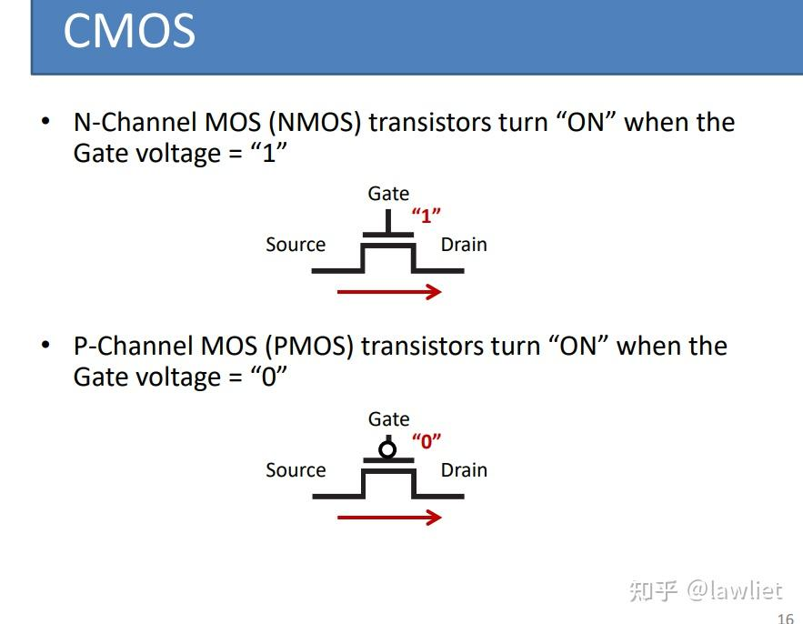
</div>   


与非逻辑上半部分的n-FETs是串联的，上面的p-FETs是并联的，二者是对偶关系。

<div align=center>
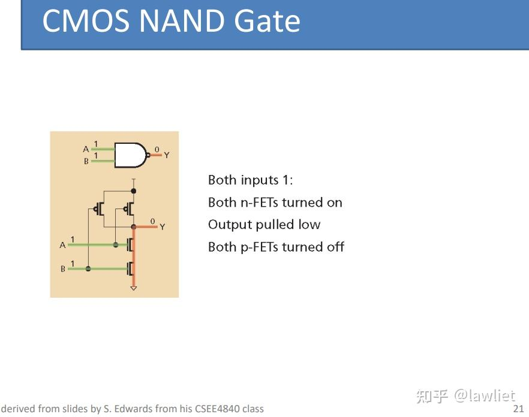
</div>   

**FPGA和ASIC的设计流程有何不同**
1. 所使用的工具不同，ASIC开发使用的工具远远多于FPGA开发
2. FPGA更多的时候是使用Vivado自带的IP库，当然ASIC设计也可以使用DesignWare等，但是其便捷性远不如Vivado的调用速度，毕竟FPGA用一个Vivado工具就可以完成整个开发流程。
3. 时钟、存储电路、IO等完全不同。FPGA开发一般调用MMCM/PLL的IP核即可，方便快捷。而ASIC设计在时钟花的时间非常多，也很复杂。还有存储电路，FPGA开发调用MIG，进行生成即可。而ASIC一般是使用制定厂商工艺库，基于Memory Compiler进行生成。IO的话FPGA一般进行XDC约束即可，而ASIC是要单独做IO PAD的。FPGA很少听说有自己动手做IO PAD的，Vivado工具已经支持的很好了，不需要过度操心。
4. FPGA通用性更强，可以反复的烧录（当然综合烧录的时间也很长）。而ASIC一旦回片，基本就定型。
5. 综合/PR不同，虽然叫一个名字，但基本是两回事。对于FPGA的CLB而言，其中的LUT实现组合逻辑，D触发器实现时序逻辑，再加上一些BRAM，硬核资源如DSP等，就可以实现任意电路。FPGA的综合就是把RTL映射到这些资源上。ASIC综合是将RTL映射到标准单元库上，有些RTL，语法是支持，但是就是综合不了。很多时候会出现Vivado可以综合过的，但DC不一定过。FPGA综合和ASIC综合区别很大很大。
6. 做ASIC基本也会用到FPGA，做原型验证。而通常说的FPGA开发是直接拿FPGA去做产品，这种广义上来讲，也可以算嵌入式开发的一部分。   


总的来说，FPGA和ASIC的设计流程前端基本是一样的，后端有很大的区别，FPGA采用FPGA芯片上的逻辑块，由Vivado等软件进行自动映射，布局布线实现。而ASIC基于标准库，由DC等工具进行综合，然后还要进行后仿真（用带有逻辑延迟的库进行仿真），再基于标准库进行布局布线等。通常我们认为ASIC的设计要比FPGA更为复杂，风险更高

### **System Verilog**

数据类型
- logic
- tri(tri0/tri1/trireg/triand/trior/tri)


always块
- always_ff
- always_latch
- always_comb

always_latch等同于always(clk, d)
always_comb等同于always(*)

<div align=center>
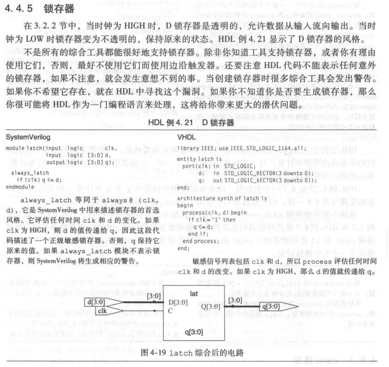
</div>   


如果在组合逻辑块中使用非阻塞赋值
- 敏感列表未包含中间变量
  - 结果：产生错误输出
- 敏感列表包含所有变量，组合逻辑会使用原来值，但是计算后发现中间值改变，会再执行计算
  - 结果：仿真变慢，结果正确

<div align=center>
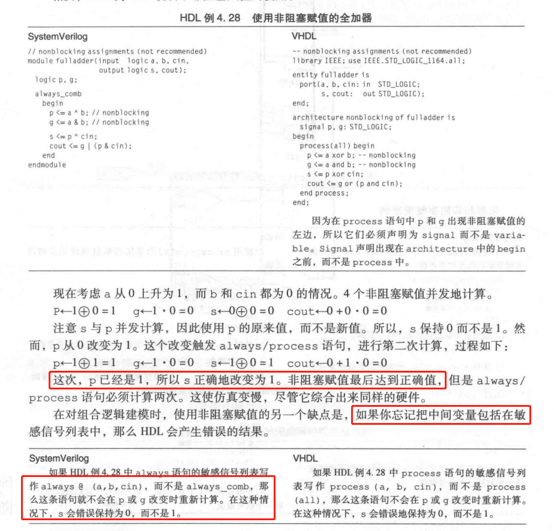
</div>   

如果在时序逻辑块中使用阻塞赋值
- 中间变量对外界透明，对输出没有影响，被同步器优化优化掉
  - 结果：生成错误电路

<div align=center>
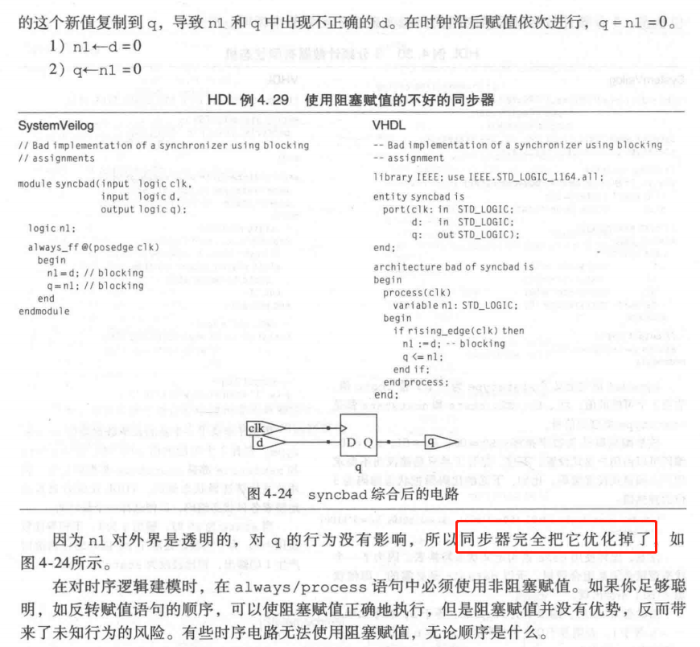
</div>   

推荐做法：组合逻辑用阻塞，时序逻辑用非阻塞


状态机
```systemverilog
module divideby3FSM(
    input logic clk,
    input logic reset,
    output logic y
);

typedef enum logic [1:0] { S0, S1, S2 } statetype;
statetype [1:0] state, next_state;

always_ff @(posedge clk, posedge reset)
    if(reset)   state <= S0;
    else state <= next_state;
end

always_comb begin
    case (state)
        S0: next_state <= S1;
        S1: next_state <= S2;
        S2: next_state <= S3;
        default: next_state <= S0;
    endcase
end

assign y = state==S0;

endmodule 
```


### **RISC-V Assembly** 

- stack pointer
- caller/callee
- procedure and MMIO


### **BSV-Combinational Logics** 

What is Bluespec?
A kind of hardware description language, which offers technology independent gates description. The full name is Bluespec System Verilog, promoted by MIT group.

<div align=center>
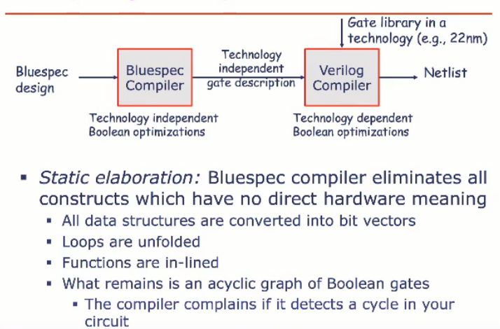
</div>   

Multiplication

<div align=center>

</div>   

Logn Shifters


### **Build a RISC-V Processor**

**4.1 基本架构**

从此节开始，将参考David Patterson的[计算机组成与设计 硬件/软件接口](https://www.elsevier.com/books/computer-organization-and-design-risc-v-edition/patterson/978-0-12-820331-6)

基本架构如下图，分为指令存储器、寄存器堆、ALU、数据存储器和选择器，接下来的部分根据图中的架构进行逐步改进，并且补充细节，添加更多的功能单元和连线。
<div align=center>
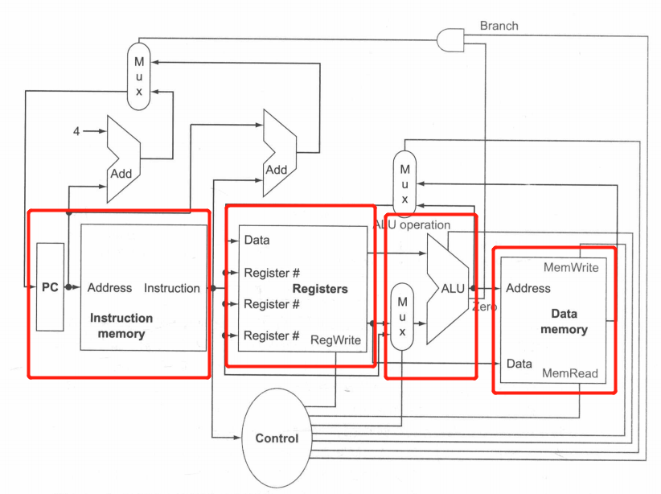
</div>   

- 数据位宽
  - 寄存器有32个，寄存器编号为5位宽
  - ALU：4位控制信号


- 算数逻辑指令（R型）
  - 功能：读取两个寄存器，执行后，再将结果写回寄存器
  - 典型指令：add, sub, and, or
  - 需要单元：寄存器堆和ALU

- 存取指令（I,S,B型）
  - 功能：存储和载入
  - 典型指令：ld, sd
  - 需要单元：寄存器堆、ALU、符号扩展单元
  - 符号扩展：如果是载入、存储或者分支条件成立时的分支指令，将指令中的12位字段符号扩展为64位输出
  - beq x1, x2, offset
  - ld x1, offset(x2)
  - sd x1, offset(x2)
  - 注1：对于JAL和分支指令，立即数代表了目标地址和当前pc的偏移量，即pc+imm=label
  - 注2：计算分支目标地址时，将偏移量左移1位，表示单位为半字，将偏移量的有效值扩大到2倍

<div align=center>
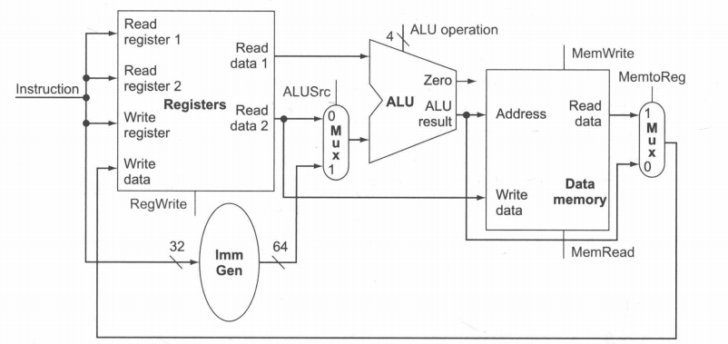
</div>   

**4.2 单周期处理器简单实现**

- 使用opcode和2位
  - 操作码字段总是0~6位，opcode[6:0]，根据操作码，funct3(opcode[14:12])和funct7(opcode[31:25])作为扩展的操作码字段

<div align=center>
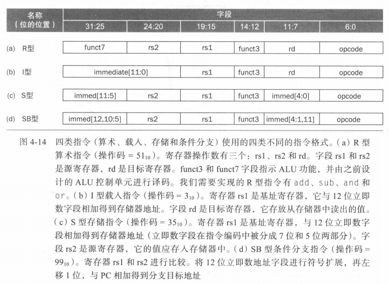
</div>   


- 设计主控制单元

根据7位操作数段opcode[6:0]，经过Control模块，可以得到2位的ALUOp和6个1位的控制线，分别代表如下意义

<div align=center>
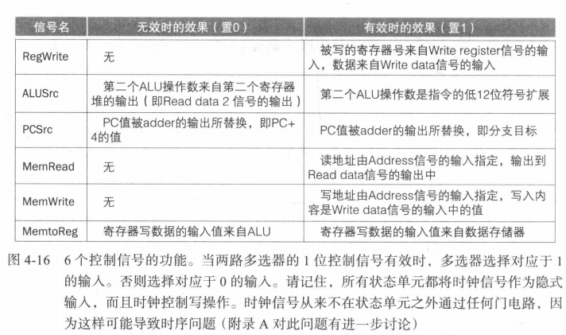
</div>   


- 数据通路操作

**add x1, x2, x3**
1. 取出指令，PC自增
2. 从寄存器堆中读取x2和x3，同时Control计算控制信号
3. 根据部分操作码确定ALU功能，对读出数据操作
4. 将ALU结果写入寄存器堆中的目标寄存器

<div align=center>
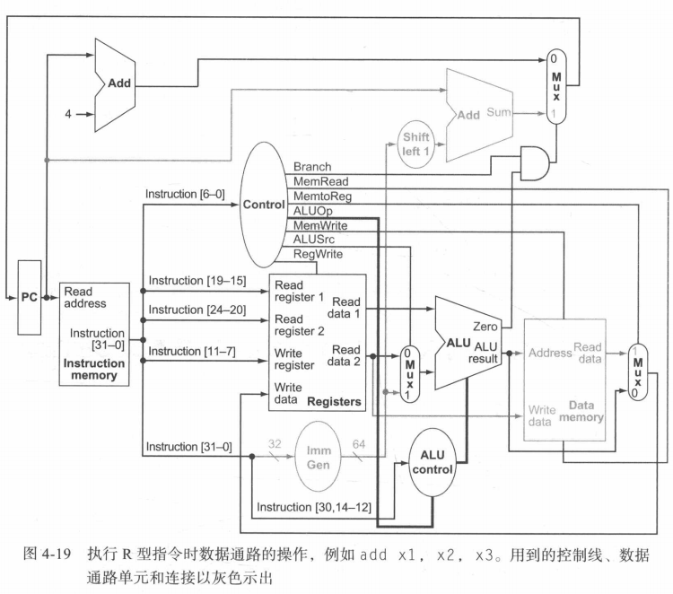
</div>   

**load x1, offset(x2)**
1. 取出指令，PC自增
2. 从寄存器堆中读取x2
3. ALU将寄存器堆中的值和符号扩展后的12位立即数相加
4. 将ALU结果作为数据存储器地址
5. 写入寄存器堆x1

<div align=center>
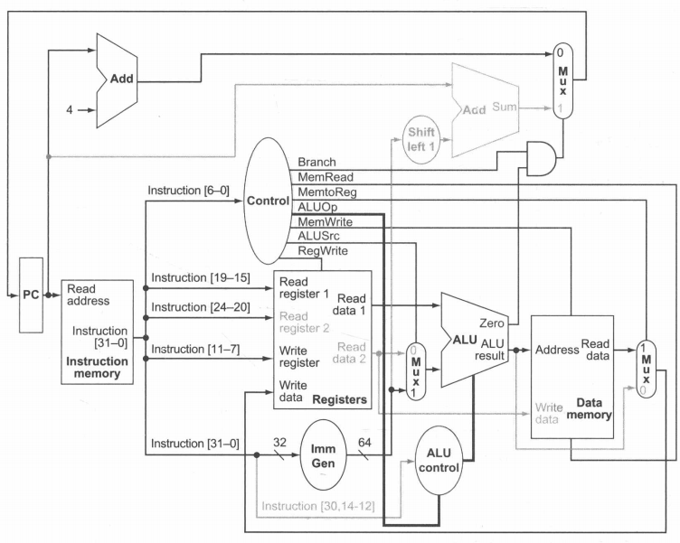
</div>   


**beq x1, x2, offset**
1. 取出指令，PC自增
2. 从寄存器堆中读取x1,x2
3. ALU从寄存器堆中读出的数相减，PC与左移一位、符号扩展指令中的12位偏移量相加，得到**分支目标地址**
4. ALU的零输出决定将哪个加法器结果写入PC

<div align=center>

</div>   

**4.3 流水线**

洗衣机流程类比流水线
<div align=center>
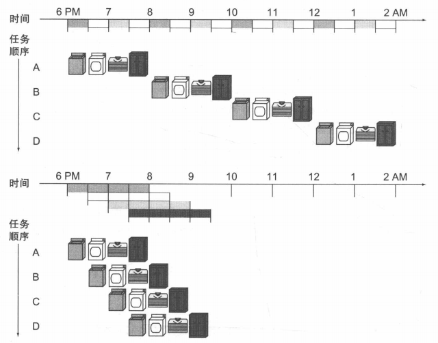
</div>   

- 流水线并没有缩短流程的运行时间
- 流水线更快的原因是所有工作并行执行，提高了洗衣系统吞吐率

<div align=center>
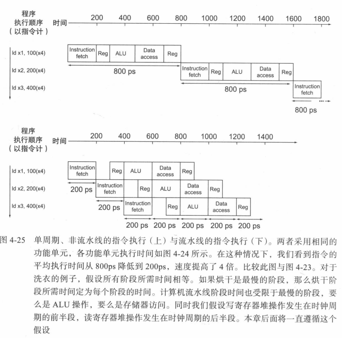
</div>   

在理想条件下和有大量指令的情况下，流水线带来的加速比约等于流水线级数


**流水线冒险**

- 结构冒险


- 数据冒险


- 控制冒险