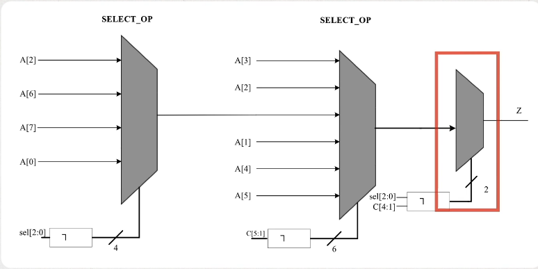
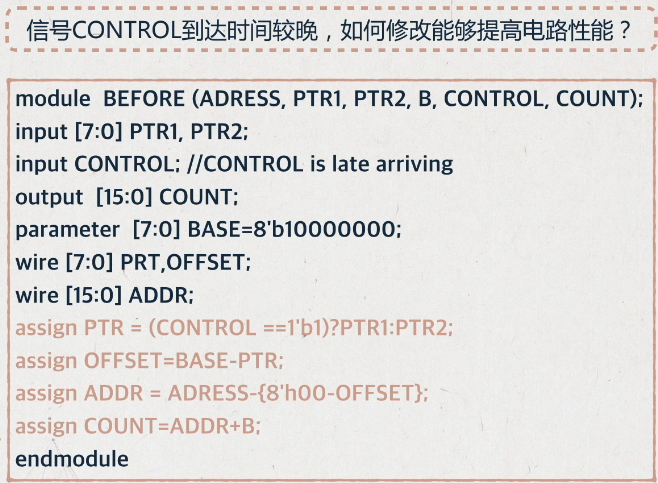
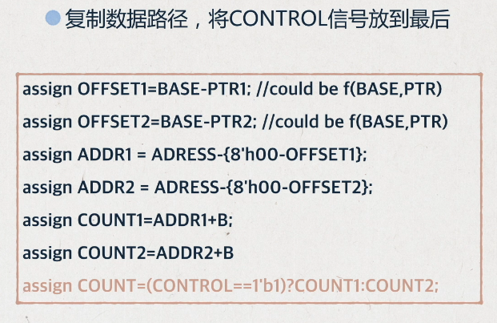

## 硬件加速设计方法
课程内容为数字集成电路设计，包括HDL代码误区、静态时序分析、FPGA硬件加速案例、基于平头哥E902的SoCial设计，具体课程见链接：https://www.icourse163.org/learn/SWJTU-1207492806

### **1.1 RTL书写中的延迟、面积**
延迟：基于延迟考虑的代码优化，核心法则：__将到来时间较晚的信号放到靠输出端口近的位置。__
- 分支支路延迟-案例1  
例如，A信号到来较晚，可以将   
    - if(A+B<24) Z<=C;
    - if(A<24-B) Z<=C;

- 分支支路延迟-案例2  
例如，case中的某一个信号来的比较晚，可以改变代码，使延迟的信号在后一级Mux出现
<div align=center>

</div>    
<div align=center>

</div>    
<div align=center>

</div>    

- 数据通路控制信号延迟   
原来的方法是先选后加，但是输入级选择Control信号到来较晚，导致延迟较大。因此可以将数据复制，先加后选，将Control信号放到最后，用面积换时间，改善了设计性能。
<div align=center>

</div>  
<div align=center>

</div>  

面积：FPGA的设计中可以通过资源共享、剔除冗余信息的方式，减小设计面积，降低成本，减少功耗  
- 多比特   
例如，访问RAM地址，地址每次递增32位，那么地址的产生可以有两种写法
  - addr<=addr+32;
  - addr[7:5]<=addr[7:5]+1; addr[4:0]<=addr[4:0]+0;
- 操作符  
例如，一个6bit数字A为6'b10_0000，那么判断该数小于32时，用"="代替"<"，可以节省一个6-bit的比较器
  - if(A<32)
  - if(A[5]=1'b1)   

简化逻辑可以实现同时减小面积和减小延时  

功耗：$P_d=\sum afCV^2$，其中a为电路的翻转次数，f为电路工作频率，C为电容，V是电压值。其中电容C和电压V无法改变，减小功耗的主要措施包括  
- 门控时钟
- 增加使能信号
- 组合逻辑的毛刺消耗功耗，因此需要将产生毛刺的电路放在最后
- 减小状态翻转次数，例如状态机编码使用低功耗编码方式，每个状态变化只需要翻转一位

> 编码方式：  
> 二进制：连续编码，效率最高，最节省资源  
> 格雷码：每次只有一个寄存器不同，但如果状态跳转不是顺序，和二进制编码同样的问题  
> One-hot: 只有一位是1，组合逻辑少，译码简单，占用资源最多  

```
parameter IDLE = 4'b0001;
parameter S1 = 4'b0010;
parameter S2 = 4'b0100;
parameter S3 = 4'b1000;

localparam IDLE_ID = 0;
localparam S1_ID = 1;
localparam S2_ID = 2;
localparam S3_ID = 4;

case(1'b1)
state[IDLE]: a<=b;
state[S1]: a<=c;
state[S2]: a<=d;
state[S3]: a<=e;
```

热点：通常是指一个面积内占用大量布线资源。例如，设计中使用了很大的Mux，在布线阶段产生了很大的延迟，因此可以分解为多级较小的Mux
<div align=center>

</div>    

### **1.2 面积换速度——流水线概述**


### **2.1 跨时钟域**


### **3.1 逻辑综合**
逻辑综合逻辑综合


### **4.1 静态时序分析**


### **5.1 FPGA硬件加速案例**

### **6.1 平头哥SoC设计体系概述**
IP集成的设计方法学，将软硬件集成在单颗IC内，其特征为
- 采用亚微米级别实现复杂功能的VLSI
- 使用嵌入式处理器或者DSP
- 采用第三方IP核
- 具备外部对芯片编程的功能

麒麟990SoC是世界上第一颗晶体管规模超过百亿的芯片，采用7nm制程，包括CPU，GPU以及神经网络处理器NPU
<div align=center>

</div>    

为了加快开发进度，提升硬件集成度，SoC包括处理器IP，硬件专用IP以及互联总线，而且一般移植了操作系统，具备软硬件协同计算能力，充分发挥软件和硬件加速IP。  

ISA对比
- 传统的ISA：增量型的指令集架构，保持向后的二进制兼容，使指令集架构复杂度随时间增长。指令繁多，分支不兼容，x86封闭，ARM授权昂贵，不可控。   
- RISC-V：将指令集划分为标准子集，保持基础扩展永远不变，为编译器和操作系统开发人员提供稳定目标。基本指令集只有40多条，开源免费，可控，起步阶段，目前面向MCU。  


### **6.2 玄铁体系架构**


