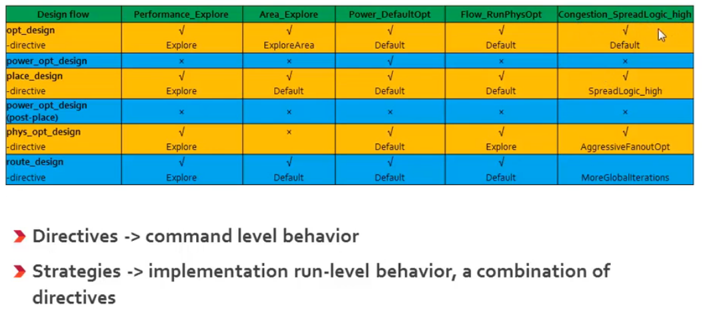
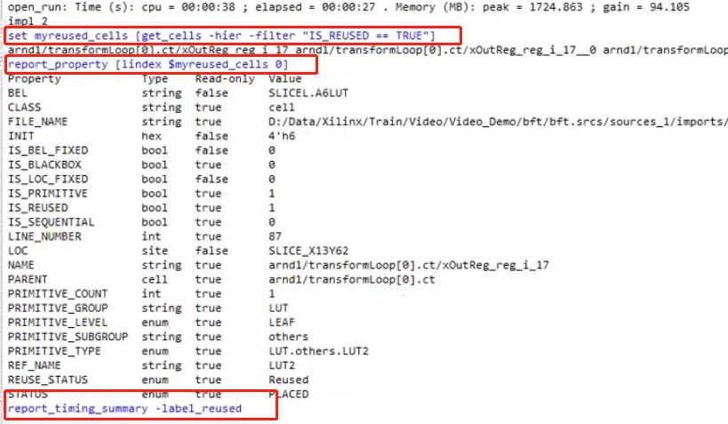

# Vivado使用细节

内容基于B站视频 [Xilinx FPGA/Vivado 开发教程](https://www.bilibili.com/video/BV1r7411j79u/)，作为个人FPGA和Vivado的知识点总结。

## 综合（Synthesis）
---    

### **Project Mode**
- GUI操作：单击流程导航器中的Run Synthesis按钮；
- TCL：运行Tcl命令，launch_runs_synth_1

### **Non-Project Mode**
- 用TCL命令方式进行综合
- synth_design -help输出命令格式，输出如下
```
synth_design  [-name <arg>] [-part <arg>] [-constrset <arg>] [-top <arg>]
              [-include_dirs <args>] [-generic <args>] [-verilog_define <args>]
              [-flatten_hierarchy <arg>] [-gated_clock_conversion <arg>]
              [-directive <arg>] [-rtl] [-bufg <arg>] [-no_lc]
              [-fanout_limit <arg>] [-shreg_min_size <arg>] [-mode <arg>]
              [-fsm_extraction <arg>] [-rtl_skip_ip] [-rtl_skip_constraints]
              [-keep_equivalent_registers] [-resource_sharing <arg>]
              [-cascade_dsp <arg>] [-control_set_opt_threshold <arg>]
              [-max_bram <arg>] [-max_uram <arg>] [-max_dsp <arg>]
              [-max_bram_cascade_height <arg>] [-max_uram_cascade_height <arg>]
              [-retiming] [-no_srlextract] [-assert] [-no_timing_driven]
              [-sfcu] [-quiet] [-verbose]

```
命令的具体选项及缺省值可以参考
- [Vivado Design Suite User Guide: Design Flows Overview (UG892)](https://docs.xilinx.com/r/en-US/ug892-vivado-design-flows-overview)  
- [Vivado Design Suite Tcl Command Reference Guide (UG835)](https://docs.xilinx.com/r/en-US/ug835-vivado-tcl-commands/place_design)
- 黑书《Xilinx权威设计指南》


**1. -no_lc**   
LUT combining，当存在共享变量时，Vivado会自动把这两个布尔表达式放在一个LUT6中实现，称之为LUT整合  
优点：降低了LUT的资源利用率，节省面积  
缺点：导致布线拥塞   
使用：选中该选项，一个LUT只实现一个表达式的功能   

注意：
- 在XST/Synplify下lc默认使能，Vivado下默认不使能    
- 首先使用report_utilization命令，输出资源使用情况，找`` LUT as logic->using O5 and O6 ``选项，如果``>15%``则说明组合过度，对于布线不利，可以关掉LC      
 
语法：  
- -no_lc unchecked
- -no_lc checked   
<div align=center>

</div>    

**2. -flatten_hierarchy**  
-flatten_hierarchy体现综合器对设计的优化程度，是一个全局设置。注意，若对设计中某个层次使用不同优化方式，用到综合属性，即在RTL代码中做标注，其优先级更高。   
``(* KEEP_HIERARCHY = "YES|SOFT|NO" *) module uart_r();``   
  - "YES"，用ILA调试时看到的层次结构跟设计是一样的
  - "SOFT"，综合后保持层次结构，但是P&R的时候可以打破层次结构进行优化   

语法：
  - none: 不展开。工具做的优化最少，因而消耗的资源也最多，但层次保留也最为完整  
  - full: 工具做的优化最多，因而消耗的资源也最少，但层次完全被打平
  - rebuilt: 默认值，层次完整性和优化力度两者的折中    


**3. -mode**  
语法：
  - global: 与全局综合，每修改一次，IP跟着综合一遍    
  - out_of_context: 对模块单独综合，生成DCP文件和STUB结尾的HDL文件

  *out_of_context相关说明*
  1. 通过综合实现某个模块的快速迭代，不用综合系统的其余部分，加快迭代。
  2. 如果设计中存在三态（高阻态），OOC综合操作就会受到影响，FPGA仅支持I/O输出端口的高阻态，在器件内部是不允许的

**4. srl_style**   
规定移位寄存器的实现方式，是FF级联还是FF+LUT
语法：
  - ``(* srl_style = "register" *)  reg[WIDTH-1:0] shreg; `` 
  - 7系列使用SRLC32E，SRL16E实现
  - 基本端口有Q, D, CLK, CE, A，没有复位端口


**5. ram_style**   
指定综合器如何生成内存   
例：``(*ram_syle = "distributed"*)reg [data_size-1:0] ram; ``    
语法：  
- block
- distributed

**6. use_dsp48**   
use_dsp48综合属性提示综合工具如何处理算术运算的实现结构，默认的情况下，如下的算术类型会被综合成DSP48
- Mult
- Mult-add&Mult-sub  
- Mult-accumulate   

语法：  
- ``(*use_dsp48="yes"*) wire [24:0] sum;``
- ``(*use_dsp48="yes"*) module adder24``

**其他**   
- **-keep_equivalent_registers**   
equivalent registers，等效寄存器，即共享输入数据的寄存器。勾选时，等效寄存器不合并；不勾选时，等效寄存器合并。等效寄存器可以有效的**降低扇出**，可以通过综合属性keep避免其被合并。

- **Vivado防止信号被综合掉的三种方法**

  1. 信号前面将keep hierarchy选择YES，或者选择soft（在综合时保持层次），这样有利于从模块中找到想抓取的信号和信号名不被更改。
  2. 信号前面使用`` (* KEEP = “TRUE|FALSE|SOFT” *)``，可以防止信号被综合掉，但是无法防止在布局布线的时候优化掉。
  3. 信号前面使用``(* DONT_TOUCH= “TRUE|FALSE” *)``，可以防止信号在综合，以及布局布线的时候被优化掉。


- **-fsm_extraction**  
综合策略中用于设定状态机的编码方式，全局属性。默认值为auto。综合后可以在报告中看到**Detected and applied attribute fsm_encoding == sequential**这样的语句，选项包括
  - auto/off
  - one-hot
  - gray
  - johnson
  - sequential


- **fsm_encoding**  
综合属性。功能同上，优先级高于-fsm_extraction，但如果代码本身已经定义了编码方式，该设定将无效。  
`` (*fsm_encoding = "sequential"*) reg [4:0] current_state,next_state;``

**创建和管理Runs**   
不同的约束、器件或者综合策略，可以生成不同的Run。可以通过GUI控制，也可以使用非工程方式，相关命令为``create_run``，``current_run``，``current_design``，例如：
- `` create_run -flow {Vivado Synthesis 2013} synth_1``
- ``create_run impl_2 -parent_run synth_1 -flow {Vivado Implementation 2013}``

**set_property**   
- ``set_property flow {Vivado Synthesis 2016} [get_runs synth_1] ``    
- ``set_property STEPS.SYNTH_DESIGN.ARGS.FANOUT_LIMIT 500 [get_runs synth_1] ``     
- ``set_property STEPS.SYNTH_DESIGN.ARGS.GATED_CLOCK_CONVERSION on [get_runs synth_1]``       
- ``set_property STEPS.SYNTH_DESIGN.ARGS.FSM_EXTRACTION one_hot [get_runs synth_1``         
- ``launch_runs synth_1``


## 布线（Implementation）
---   

布局布线的流程包括
1. opt_design
2. power_opt_design
3. place_design
4. power_opt_design(post_place)
5. phys_opt_design
6. route_design
7. write_bitstream   

可以根据每个步骤所采取的运行策略不同，自定义运行策略

### **Project Mode**
- GUI操作：单击流程导航器中的Implementation按钮；
- TCL：运行Tcl命令，launch_runs_synth_1

### **Non-Project Mode**
- 可以建立如下TCL脚本命令，source
<div align=center>

</div>    


**directive**   
命令级别行为，确定不同的布线策略，得到布线算法
- Explore
- Default
- RuntimeOptimized
- Quick

**strategies**    
运行级别的行为，一系列directive的组合
- Performance_Explore（增加编译时间）
- Area_Explore
- Power_DefaultOpt
- Flow_RunPhysOpt
- Congestion_SpreadLogic_high
<div align=center>

</div>    

**launch_runs**   
- ``launch_runs -to_step place_design``
- ``launch_runs impl_1 -to_step "power_opt_design(Post_Place)"``加引号
- ``launch_runs impl_1 -next_step``
<div align=center>

</div>  


**place_design**   
具体命令格式如下，选择具体的directive后，其他选项均不可以选。
```
place_design [‑directive <arg>] [‑no_timing_driven] 
    [‑timing_summary] [‑unplace] 
    [‑post_place_opt] [‑no_psip] 
    [‑no_bufg_opt] [‑ultrathreads]
    [‑quiet] [‑verbose]
```
- -post_place_opt   
  - 执行布局优化，检查关键路径（对时序最差的路径做优化）
  - 在布局后任意阶段都可以运行，**在route阶段后更有效**
  - 代价是更长的运行时间
```
place_design
phys_opt_design
route_design
place_design -post_place_opt
route_design      // 重新布线
```

**route_design**   
布线命令
- 保存当前结果，其余的加速布线，命令：`` route_design -preserved -directive RuntimeOptimized``  
- 撤销当前布线：`` route_design -unroute``
    
语法：
- preserved
- delay
- max_delay
- min_delay

**phys_opt_design**   
做物理优化，每次针对性的优化对应一个选项    
``phys_opt_design -directive AggressiveFanoutOpt ``     

```
phys_opt_design [‑fanout_opt] [‑placement_opt] [‑routing_opt]
    [‑slr_crossing_opt] [‑rewire] [‑insert_negative_edge_ffs]
    [‑critical_cell_opt] [‑dsp_register_opt] [‑bram_register_opt]
    [‑uram_register_opt] [‑bram_enable_opt] [‑shift_register_opt]
    [‑hold_fix] [‑aggressive_hold_fix] [‑retime]
    [‑force_replication_on_nets <args>] [‑directive <arg>]
    [‑critical_pin_opt] [‑clock_opt] [‑path_groups <args>] [‑tns_cleanup]
    [‑sll_reg_hold_fix] [‑quiet] [‑verbose]
```
- retime   
  通过改变寄存器在组合逻辑中的位置，平衡路径延时  

- **Vivado使时序收敛的几种命令**
  1. -place_design -post_place_opt
  2. phys_opt_design
  3. route_design-delay-nets   
  4. Strategy选择Performance_Explore也有助于达到时序收敛（Timing Closure）  

## 增量设计
---   
当设计中只有5%以下的内容改变时，采用增量编译，可以提升3倍以上的布局速度。根据选择DCP的文件，进行增量编译。
- Design Runs窗口中，右键选择``open run directory``
- ``Create New Runs``
- 右键选择检查点``Set Incremental Compile``
- ``make active``当前的runs(current_run [get_runs synth_2])
- ``launch_runs impl_2 -jobs 4``
- 输入TCL指令得到输出报告，如下所示
  - ``set my_reused_cells [get_cells -hier -filter "IS_REUSED == TRUE"]``
  - ``report_property [lindex $myreused_cells 0]``
  - ``report_timing_summary -label_reused``

<div align=center>

</div>  


### **影响增量布局布线的因素**
- 小的RTL的改变
  - 增大MEM尺寸
  - 内部连线变宽
  - 数据类型由无符号变为有符号
- 约束和综合选项的改变
  - 时序约束改变和重新综合
  - 逻辑层次改变
  - 使用重定时

### 增量模式的注意事项
- 两次runs必须有相同的策略
- -directive命令失效
- phys_opt_design没有增量模式，只有place和route有


## 最常用的TCL命令
---

**port和pin的区别**
- pin是cell的输出输入
- port是与外部的管脚（package pin）连接

<div align=center>

</div>  

**Get_命令**
- ``-hierarchical <-> -hier``
- ``-of_objects <-> -of``
- ``-filter``

案例1：  
``get_cells -hier {A* B*}``
<div align=center>

</div>  

- ``get_ports -filter {PACKAGE_PIN==""}``    检查没有约束的管脚
- ``get_ports -filter {UNCONNCECTED==1}``    输出没有连接的管脚

案例2：get_cells&change property
<div align=center>

</div>  
案例3：leaf的作用（返回primitive层次）
<div align=center>

</div>  


## 时序分析术语
---


## 高级时钟约束
---


### 输入延时约束
---


### 输出延时约束


## 资源与扇出分析


## Ultrafast


## HLS设计方法


* vmod/ -- RTL model, including:
  * vmod/nvdla/ -- Verilog implementation of NVDLA
  * vmod/vlibs/ -- library and cell models
  * vmod/rams/ -- behavioral models of RAMs used by NVDLA
* syn/ -- example synthesis scripts for NVDLA
* perf/ -- performance estimator spreadsheetfor NVDLA
* verif/ -- trace-player testbench for basicsanity validation
  * verif/traces/ -- sample traces associated with various networks
* tools -- tools used for building the RTL andrunning simulation/synthesis/etc.
* spec -- RTL configuration option settings.
