## 硬件加速设计方法
课程内容为数字集成电路设计，包括HDL代码误区、静态时序分析、FPGA硬件加速案例、基于平头哥E902的SoCial设计，具体课程见链接：https://www.icourse163.org/learn/SWJTU-1207492806    
目的：学习小记录+FPGA/IC知识备份

### **1.1 RTL书写中的延迟、面积**
延迟：基于延迟考虑的代码优化，核心法则：__将到来时间较晚的信号放到靠输出端口近的位置。__
- 分支支路延迟-案例1  
例如，A信号到来较晚，可以将   
    - if(A+B<24) Z<=C;
    - if(A<24-B) Z<=C;

- 分支支路延迟-案例2  
例如，case中的某一个信号来的比较晚，可以改变代码，使延迟的信号在后一级Mux出现
<div align=center>
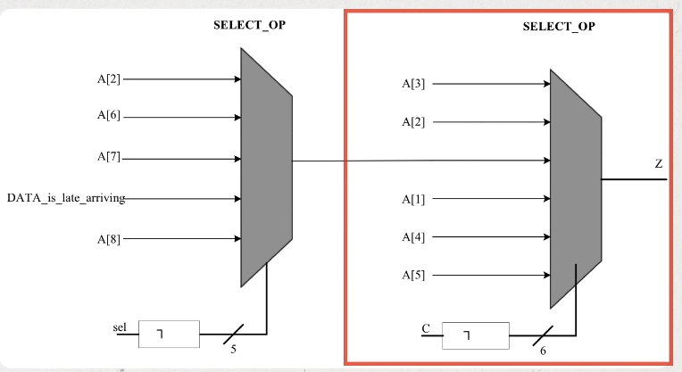
</div>    
<div align=center>

</div>    
<div align=center>
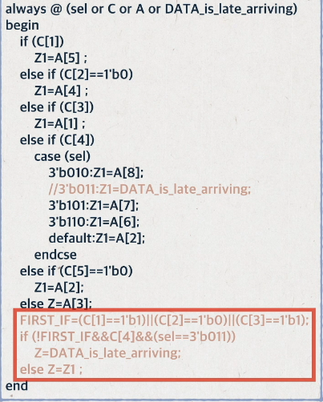
</div>    

- 数据通路控制信号延迟   
原来的方法是先选后加，但是输入级选择Control信号到来较晚，导致延迟较大。因此可以将数据复制，先加后选，将Control信号放到最后，用面积换时间，改善了设计性能。
<div align=center>
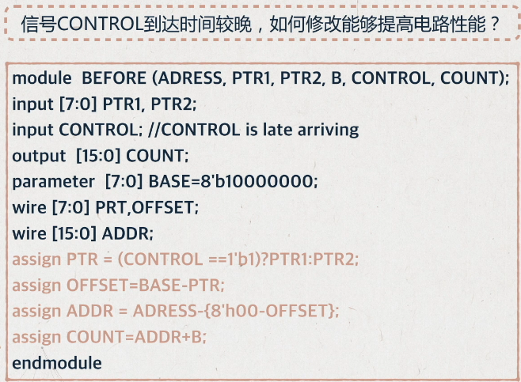
</div>  
<div align=center>
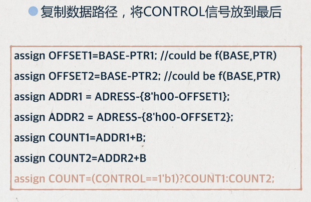
</div>  

面积：FPGA的设计中可以通过资源共享、剔除冗余信息的方式，减小设计面积，降低成本，减少功耗  
- 多比特   
例如，访问RAM地址，地址每次递增32位，那么地址的产生可以有两种写法
  - addr<=addr+32;
  - addr[7:5]<=addr[7:5]+1; addr[4:0]<=addr[4:0]+0;
- 操作符  
例如，一个6bit数字A为6'b10_0000，那么判断该数小于32时，用"="代替"<"，可以节省一个6-bit的比较器
  - if(A<32)
  - if(A[5]=1'b1)   

简化逻辑可以实现同时减小面积和减小延时  

功耗：$P_d=\sum afCV^2$，其中a为电路的翻转次数，f为电路工作频率，C为电容，V是电压值。其中电容C和电压V无法改变，减小功耗的主要措施包括  
- 门控时钟
- 增加使能信号
- 组合逻辑的毛刺消耗功耗，因此需要将产生毛刺的电路放在最后
- 减小状态翻转次数，例如状态机编码使用低功耗编码方式，每个状态变化只需要翻转一位

> 编码方式：  
> 二进制：连续编码，效率最高，最节省资源  
> 格雷码：每次只有一个寄存器不同，但如果状态跳转不是顺序，和二进制编码同样的问题  
> One-hot: 只有一位是1，组合逻辑少，译码简单，占用资源最多  

```
parameter IDLE = 4'b0001;
parameter S1 = 4'b0010;
parameter S2 = 4'b0100;
parameter S3 = 4'b1000;

localparam IDLE_ID = 0;
localparam S1_ID = 1;
localparam S2_ID = 2;
localparam S3_ID = 4;

case(1'b1)
state[IDLE]: a<=b;
state[S1]: a<=c;
state[S2]: a<=d;
state[S3]: a<=e;
```

热点：通常是指一个面积内占用大量布线资源。例如，设计中使用了很大的Mux，在布线阶段产生了很大的延迟，因此可以分解为多级较小的Mux
<div align=center>
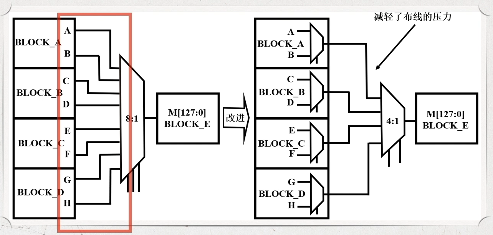
</div>    

### **1.2 面积换速度——流水线概述**


### **2.1 跨时钟域**
亚稳态：由于异步时钟导致触发器违反保持和建立时间，使触发器锁存到一个无效电平的状态（可能是1，可能是0，更有可能是无效电平X），称作亚稳态现象。

注意：不定态X和逻辑上的X不是同一个概念。
- 逻辑X：当前寄存器未知，但是物理上一定是有效的，不是1就是0
- 不定态X：触发器输入端信号电平**没有到达物理器件的有效电平的噪声容限**内，导致由接成反馈回路的两个反相器构成的触发器稳定在第三稳定点，后续电路可以理解为正确度电平，也可能是错误的电平。

<div align=center>
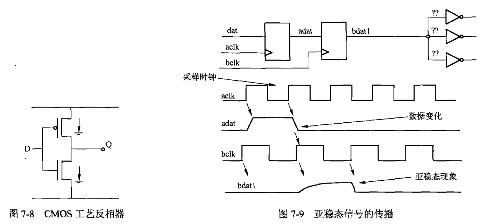
</div>    

从数字集成电路角度分析，PMOS和NMOS通过不同导通关断产生的高低电平区别0和1状态，稳定状态下，PMOS和NMOS不可能同时导通，亚稳态打破了这个规则。以图7-8的反相器为例
- 当D端输入为1，NMOS导通，PMOS关闭，Q输出为0
- 当D端输入为0，NMOS关闭，PMOS导通，Q输出为1
- 当D端没有达到有效电平的噪声容限时，可能会使PMOS和NMOS同时导通，这是一个没有定义状态，可能会导致继续往下传播，导致后续电路完全失效。

<div align=center>
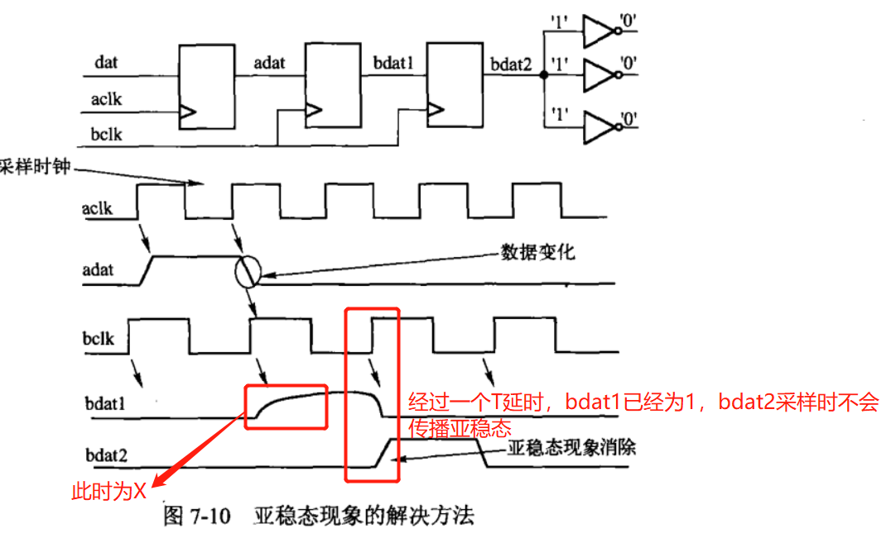
</div>    

注意：完全解决亚稳态现象的方法不存在。
- 触发器可能正好采集到输入信号变化的中点，从此点回复稳定电平所需时间理论上为无穷大，第二级同样将采样到第一级的亚稳态电平，仍然是亚稳态。
- 实际电路中极小的噪声都会使触发器脱离亚稳态。
- 系统工作频率过高，两级同步器不足以解决问题，可能需要增加同步触发器级数，延长等待时间等等。

### **2.2 FIFO知识点总结**
容量计算

**FIFO设计中的亚稳态问题**：FIFO有效解决两个时钟源间数据同步的关系，但是亚稳态问题被隐藏在FIFO空信号的产生逻辑上了。   
- 通过比较FIFO的读/写指针是否相等判断非空，因此需要做时钟同步
- 指针是多位信号，因此用``格雷码代替二进制码``，减小毛刺出现概率

二进制转格雷码：最高位保存，剩下的右移异或   

```
a = {a[LEN-1], a[LEN-1:1] ^ a[LEN-2：0]}
```

格雷码转二进制码：最高位保存，**迭代** 二进制当前位 = 高位^格雷码当前位
```
always @ (Gry)begin       
	Bin[length-1]=Gry[length-1];       
	for(i=length-2;i>=0;i=i-1)               
	Bin[i]=Bin[i+1]^Gry[i];
end 
```

异步FIFO的存储深度只能是2^n的原因：由于格雷码是每2^n个一循环，保证首尾的数据仅有一位发生变化

格雷码加法器
```
always@(posedge clk or negedge rst_n)
if (~rst_n)
  gray <= 'd0;
else
  gray <= gray_nxt;
always@(gray or inc)
begin
  // gray2bin
  bin[SIZE-1] = gray[SIZE-1];
  for(i=SIZE-2;i>0;i=i-1)
    bin[i] = bin[i+1]^gray[i];             // bin = ^(gray>>i);
  bin_nxt = bin + inc;
  // bin2gray
  gray_nxt = (bin_nxt>>1)^bin_nxt;
end
```
	

### **2.3 复位**

- 同步复位
  - 有利于仿真
  - 使系统成为100%时序电路，有利于时序分析，fmax较高
  - 可以滤除复位信号中高于时钟频率的毛刺
  - 复位信号时长需要大于时钟周期，需要考虑组合逻辑延迟，时钟偏移
  - DFF只有异步复位端口，因此需要浪费更多的资源   

同步复位信号周期计算
<div align=center>
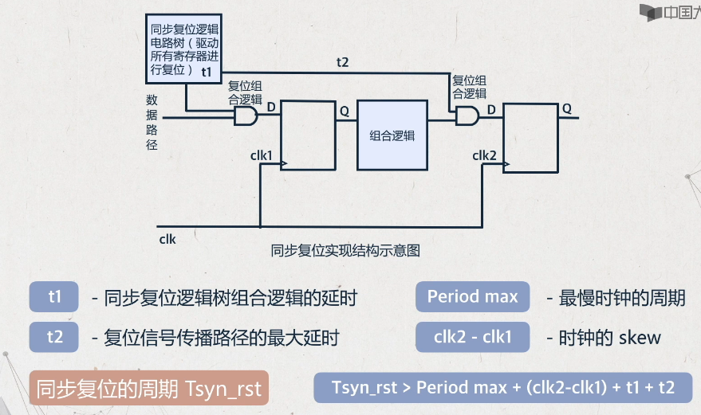
</div>    

- 异步复位
  - 大多数目标器件的DFF都有异步复位端口
  - 信号识别简单，可以利用FPGA全局复位端口GSR
  - 复位释放时在时钟有效沿时，容易出现亚稳态 

异步复位同步释放电路设计
```
assign rst_o = rst_n_d2; 
always@(posedge clk or negedge rst_n)
begin
  if(~rst_n) begin
    rst_n_d1 <= 1'b0;
    rst_n_d2 <= 1'b0;
  end
  else begin
    rst_n_d1 <= 1'b1;
    rst_n_d2 <= rst_n_d1;
  end
end
```
<div align=center>
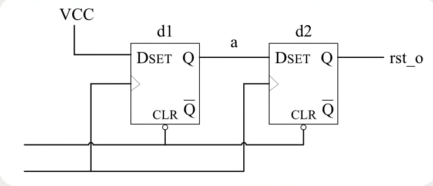
</div>    

复位信号的扇出往往仅次于时钟信号，因此可能利用**多块**异步复位同步释放电路，然而这种方式可能由于前级寄存器在时钟边沿释放，导致存在一个周期的偏差，导致时序错乱。
<div align=center>
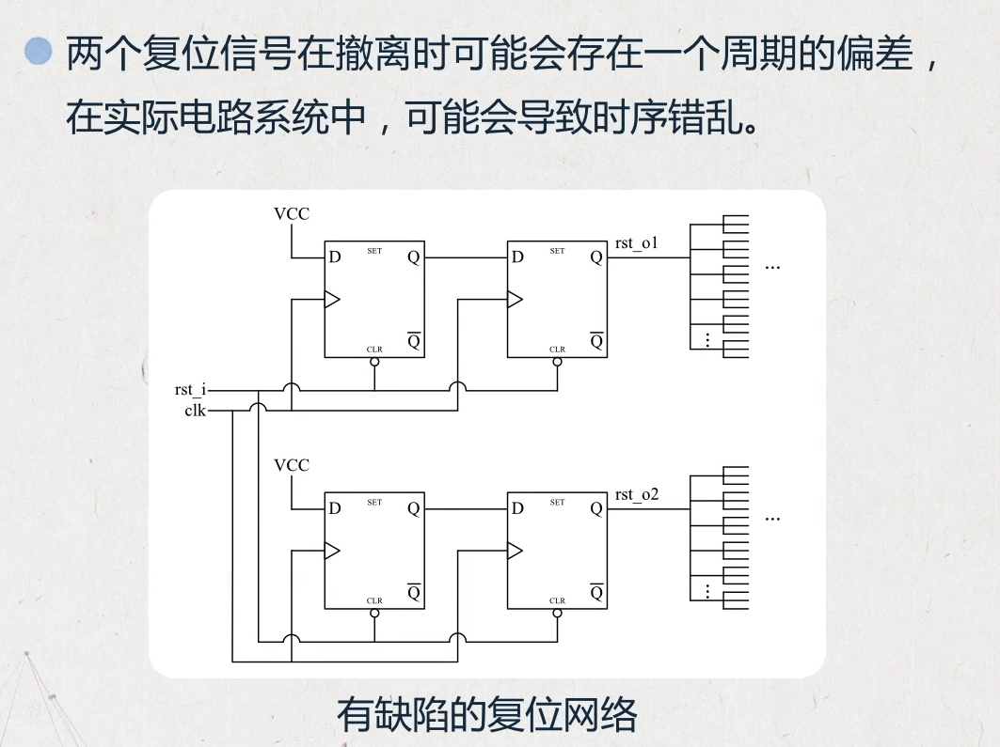
</div>    

正确的复位电路复制方式【复位分发技术】
<div align=center>
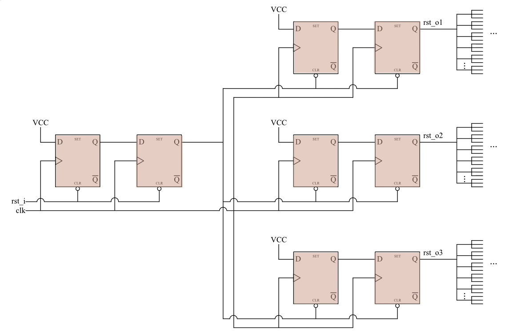
</div>    

### **2.4 状态机相关**
- 三段式：时序逻辑保存状态，组合逻辑控制状态转移，时序逻辑用``next_state``输出。优点：时序易分组，不用考虑状态转移条件对于输出的影响。
- 两段式：时序逻辑保存状态，组合逻辑控制状态转移，组合逻辑用``current_state``输出。缺点：由于输出是组合逻辑控制，因此会导致毛刺，所以最好将输出打一拍（但又会导致时序问题）
- 一段式：不推荐，逻辑混乱，难以维护。必须要考虑现态在何种条件下转移进入哪些次态，在每个现态的case下描述次态的输出。  

<div align=center>
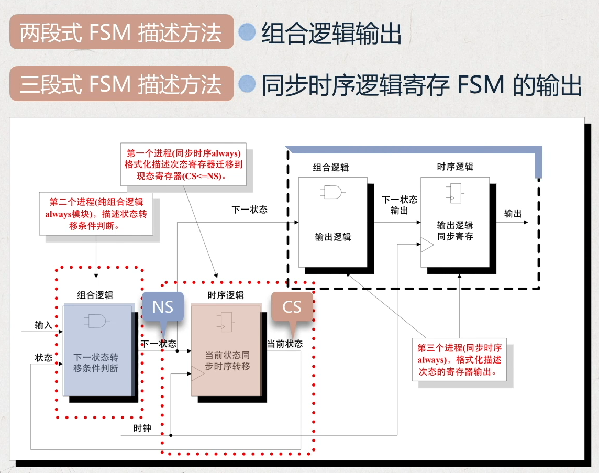
</div>    

注意1：两段式用状态寄存器分割了两部分组合逻辑（状态转移和输出），输出是由``current_state``决定，时序路径较短；三段式的输出逻辑是从``next_state``开始，因此状态转移和输出逻辑中的时序逻辑可以看为一体，该路径的时序就会比较紧张。   
注意2：如果允许在输出级打一拍，选择两段式性能更好。


### **3.1 逻辑综合**
逻辑综合逻辑综合


### **4.1 静态时序分析**
     
是

### **5.1 FPGA硬件加速案例**
Softmax函数的软硬件实现

### **6.1 平头哥SoC设计体系概述**
IP集成的设计方法学，将软硬件集成在单颗IC内，其特征为
- 采用亚微米级别实现复杂功能的VLSI
- 使用嵌入式处理器或者DSP
- 采用第三方IP核
- 具备外部对芯片编程的功能

麒麟990SoC是世界上第一颗晶体管规模超过百亿的芯片，采用7nm制程，包括CPU，GPU以及神经网络处理器NPU
<div align=center>
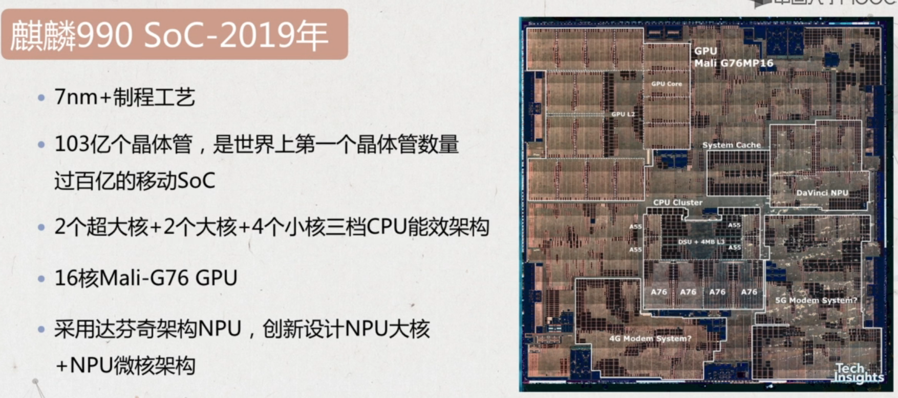
</div>    

为了加快开发进度，提升硬件集成度，SoC包括处理器IP，硬件专用IP以及互联总线，而且一般移植了操作系统，具备软硬件协同计算能力，充分发挥软件和硬件加速IP。  

ISA对比
- 传统的ISA：增量型的指令集架构，保持向后的二进制兼容，使指令集架构复杂度随时间增长。指令繁多，分支不兼容，x86封闭，ARM授权昂贵，不可控。   
- RISC-V：将指令集划分为标准子集，保持基础扩展永远不变，为编译器和操作系统开发人员提供稳定目标。基本指令集只有40多条，开源免费，可控，起步阶段，目前面向MCU。  


### **6.2 玄铁体系架构**


