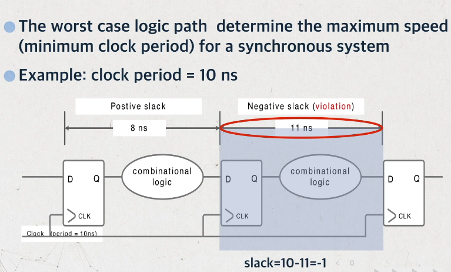

## 硬件加速设计方法
课程内容为数字集成电路设计，包括HDL代码误区、静态时序分析、FPGA硬件加速案例、基于平头哥E902的SoCial设计，具体课程见链接：https://www.icourse163.org/learn/SWJTU-1207492806    
目的：学习小记录+FPGA/IC知识备份

### **1.1 RTL书写中的延迟、面积**
延迟：基于延迟考虑的代码优化，核心法则：__将到来时间较晚的信号放到靠输出端口近的位置。__

- 分支支路延迟-案例1  
例如，A信号到来较晚，可以将   
	- if(A+B<24) Z<=C;
	- if(A<24-B) Z<=C;
<div align=center>

</div>   


- 分支支路延迟-案例2  
例如，case中的某一个信号来的比较晚，可以改变代码，使延迟的信号在后一级Mux出现
<div align=center>

</div>    
<div align=center>

</div>    
<div align=center>

</div>    

- 数据通路控制信号延迟   
原来的方法是先选后加，但是输入级选择Control信号到来较晚，导致延迟较大。因此可以将数据复制，先加后选，将Control信号放到最后，用面积换时间，改善了设计性能。
<div align=center>

</div>  
<div align=center>

</div>  

面积：FPGA的设计中可以通过资源共享、剔除冗余信息的方式，减小设计面积，降低成本，减少功耗  
- 多比特   
例如，访问RAM地址，地址每次递增32位，那么地址的产生可以有两种写法
  - addr<=addr+32;
  - addr[7:5]<=addr[7:5]+1; addr[4:0]<=addr[4:0]+0;
- 操作符  
例如，一个6bit数字A为6'b10_0000，那么判断该数小于32时，用"="代替"<"，可以节省一个6-bit的比较器
  - if(A<32)
  - if(A[5]=1'b1)   

简化逻辑可以实现同时减小面积和减小延时  

功耗：$P_d=\sum afCV^2$，其中a为电路的翻转次数，f为电路工作频率，C为电容，V是电压值。其中电容C和电压V无法改变，减小功耗的主要措施包括  
- **门控时钟**
- **增加使能信号**
- **组合逻辑的毛刺消耗功耗，因此需要将产生毛刺的电路放在最后**
- **减小状态翻转次数，例如状态机编码使用低功耗编码方式，每个状态变化只需要翻转一位**


> 编码方式：  
> 二进制：连续编码，效率最高，最节省资源  
> 格雷码：每次只有一个寄存器不同，但如果状态跳转不是顺序，和二进制编码同样的问题  
> One-hot: 只有一位是1，组合逻辑少，译码简单，占用资源最多  


```verilog
parameter IDLE = 4'b0001;
parameter S1 = 4'b0010;
parameter S2 = 4'b0100;
parameter S3 = 4'b1000;

localparam IDLE_ID = 0;
localparam S1_ID = 1;
localparam S2_ID = 2;
localparam S3_ID = 4;

case(1'b1)
state[IDLE]: a<=b;
state[S1]: a<=c;
state[S2]: a<=d;
state[S3]: a<=e;
```

热点：通常是指一个面积内占用大量布线资源。例如，设计中使用了很大的Mux，在布线阶段产生了很大的延迟，因此可以分解为多级较小的Mux
<div align=center>

</div>    


### **1.2 面积换速度——流水线概述**


### **2.1 跨时钟域CDC**
亚稳态：由于**异步时钟导致触发器违反保持和建立时间**，使触发器锁存到一个无效电平的状态（可能是1，可能是0，更有可能是无效电平X），称作亚稳态现象。

注意：不定态X和逻辑上的X不是同一个概念。
- 逻辑X：当前寄存器未知，但是物理上一定是有效的，不是1就是0
- 不定态X：触发器输入端信号电平**没有到达物理器件的有效电平的噪声容限**内，导致由接成反馈回路的两个反相器构成的触发器稳定在第三稳定点，后续电路可以理解为正确度电平，也可能是错误的电平。

<div align=center>

</div>    

从数字集成电路角度分析，PMOS和NMOS通过不同导通关断产生的高低电平区别0和1状态，稳定状态下，PMOS和NMOS不可能同时导通，亚稳态打破了这个规则。以图7-8的反相器为例
- 当D端输入为1，NMOS导通，PMOS关闭，Q输出为0
- 当D端输入为0，NMOS关闭，PMOS导通，Q输出为1
- 当D端没有达到有效电平的噪声容限时，可能会使PMOS和NMOS同时导通，这是一个没有定义状态，可能会导致继续往下传播，导致后续电路完全失效。

<div align=center>

</div>    

注意：完全解决亚稳态现象的方法不存在。
- 触发器可能正好采集到输入信号变化的中点，从此点回复稳定电平所需时间理论上为无穷大，第二级同样将采样到第一级的亚稳态电平，仍然是亚稳态。
- 实际电路中极小的噪声都会使触发器脱离亚稳态。
- 系统工作频率过高，两级同步器不足以解决问题，可能需要增加同步触发器级数，延长等待时间等等。

### **2.2 FIFO知识点总结**

### **[单bit信号跨时钟域CDC传输]**
- 慢到快
  - 双锁存器法（电平同步）
  - 边沿检测电路（脉冲同步，打两拍后边沿检测）
- 快到慢
  - 脉冲同步器
  - 结绳法
	- 将Din作为时钟，输入置1，相当于展宽脉冲，需要``4个DFF``  
	- 将Din作为复位，需要``2个DFF``，注意是Set/Reset
	- 利用握手协议，需要``8个DFF``
	- 快时钟域的信号变化频率不能超过3倍慢时钟域（下一个脉冲需要晚3个周期）
	- 适合脉冲间隔较大的控制信号
- 为什么不能直接从慢时钟采快时钟的信号？
  - 慢到快：亚稳态问题
  - 快到慢：采样速率问题，采样频率高于信号最高频率的2倍

<div align=center>

</div>    
<div align=center>

</div>    

<div align=center>

</div>    


### **[多bit信号跨时钟域传输]**

- 控制信号（使数据稳定下来再让另一个时钟采样）
  - 能合并，例如load，en两个信号clk_a下同步（有小的skew），导致传到clk_b下差一个周期，解决方法：合并信号成一个信号，再去另一个时钟域下采样
  - 不能合并，例如译码信号。解决方法：添加另一个控制信号，保证稳定时采样
- 数据信号
  - 异步FIFO
  - RAM

<div align=center>

</div>    


### **[FIFO计算]**
- 空满状态判断
  - 同步状态使用二进制码
	- 深度为$2^n$的FIFO，读写指针位宽为$(n+1)$位。最高位是折回标志位
	- 当读写指针越过最后一个地址时，MSB翻转。
	- 判断条件：其他位相同，MSB不同，为满；MSB相同，为空。
  - 异步状态下使用格雷码，格雷码具有低$(n-1)$位中间对称的性质，因此``格雷码判断满的条件不同``
	- 条件1：wr_ptr和rd_ptr同步的**MSB**不相等
	- 条件2：wr_ptr和rd_ptr的**次高位**不相等
	- 条件3：wr_ptr和rd_ptr的其他位完全相等
- 容量
  - 数据轻载、重载（最坏情况，背靠背写入）
  - 写入的数据-读出数据
  - $depth= burst\_len - \frac{burst\_len}{wclk}\times{rclk\times\frac{X}{Y}}$

- 其他
  - 若非2次幂深度，格雷码已经不再适用
	- 深度为偶数，采用最接近$2^n$的格雷码进行修改。例如深度为6(111->000)的情况下，因此可以将5的指针设为100
	- 深度为奇数，自行设计查找表等逻辑电路
	- 设置为2次幂，浪费空间，简化控制电路
  - 格雷码亚稳态**失效后果**及注意事项
	- 只是保证读写地址在出错的情况下仍然保证FIFO正确性，地址出错总是存在的。
	- 例如，写地址加1，读地址没有进行同步时，地址最多没有跳变，而不会产生空读
	- 地址总线的bus skew不能超过1个周期，否则格雷码会出现多位数据跳变

  - 空满标志判断存在漏洞
	- 同步后的读地址，小于当前读地址
	- 写地址同理，均更保守策略
  - FIFO—STA
	- 低频情况：设置wclk和rclk之间的false path
	- 高频情况：28nm以下，需要检查两级触发器下的延迟
	- P&R时，需要将两级同步器放到一起

### **[FIFO设计中的亚稳态问题]**   
FIFO有效解决两个时钟源间数据同步的关系，但是亚稳态问题被隐藏在FIFO空信号的产生逻辑上了。   
- 通过比较FIFO的读/写指针是否相等判断非空，因此需要做时钟同步
- 指针是多位信号，因此用``格雷码代替二进制码``，减小毛刺出现概率


二进制转格雷码：最高位保存，剩下的右移异或   

```verilog
assign a = {a[LEN-1], a[LEN-1:1] ^ a[LEN-2:0]};
```

格雷码转二进制码：最高位保存，**迭代** 二进制当前位 = 高位^格雷码当前位
```verilog
always @ (Gry)begin
	Bin[length-1]=Gry[length-1];
	for(int i=length-2;i>=0;i=i-1)
	Bin[i]=Bin[i+1]^Gry[i];
end 
```
### **[大FIFO的深度选择]**   
- 异步FIFO的存储深度只能是2^n的原因：由于格雷码是每2^n个一循环，保证首尾的数据仅有一位发生变化
- 问题：深度很大时，额外空间非常巨大，例如需要深度为300的FIFO，只能使用512，有200个额外空间
- 解决办法一：使用两个FIFO，深度为300的同步FIFO，跟随一个小的异步FIFO，用于与其他时钟域同步
- 解决办法二：对任何数值建立偶数格雷码计数器。通过增加计数偏移量来实现，不是从0到$2^n$，从$(2^n)/2-fifo{\_}depth/2$到$(2^n)/2+fifo{\_}depth/2-1$，代入例子，表示为106(0_1010_1111)到405(1_0101_1111)

格雷码加法器
```verilog
integer i;

always @(posedge clk or negedge rstn) begin
    if(!rstn) begin
        Gray_reg <= 0;
    end
    else begin
        Gray_reg <= Gray_next_reg;
    end
end

always @(*) begin
    Bin_reg[length-1] = Gray_reg[length-1];    // 格雷码转二进制码
    for(i=length-2;i>=0;i=i-1)
        Bin_reg[i] = Bin_reg[i+1]^Gray_reg[i];
    Bin_next_reg = Bin_reg + inc;              // 二进制码加1
    Gray_next_reg = (Bin_next_reg>>1)^Bin_next_reg;   // 二进制码转回格雷
end
     
assign Gray = Gray_reg;
```
	


### **2.3 复位**

- 同步复位
  - 有利于仿真
  - 使系统成为100%时序电路，有利于时序分析，fmax较高
  - 可以滤除复位信号中高于时钟频率的毛刺
  - 复位信号时长需要大于时钟周期，需要考虑组合逻辑延迟，时钟偏移
  - DFF只有异步复位端口，因此需要浪费更多的资源   

同步复位信号周期计算
<div align=center>

</div>    

- 异步复位
  - 大多数目标器件的DFF都有异步复位端口
  - 信号识别简单，可以利用FPGA全局复位端口GSR
  - 复位释放时在时钟有效沿时，容易出现亚稳态 

异步复位同步释放电路设计
```verilog
assign rst_o = rst_n_d2; 
always@(posedge clk or negedge rst_n)
begin
  if(~rst_n) begin
	rst_n_d1 <= 1'b0;
	rst_n_d2 <= 1'b0;
  end
  else begin
	rst_n_d1 <= 1'b1;
	rst_n_d2 <= rst_n_d1;
  end
end
```
<div align=center>

</div>    

复位信号的扇出往往仅次于时钟信号，因此可能利用**多块**异步复位同步释放电路，然而这种方式可能由于前级寄存器在时钟边沿释放，导致存在一个周期的偏差，导致时序错乱。
<div align=center>

</div>    

正确的复位电路复制方式【复位分发技术】
<div align=center>

</div>    

### **2.4 状态机相关**
- 三段式：时序逻辑保存状态，组合逻辑控制状态转移，时序逻辑用``next_state``输出。优点：时序易分组，不用考虑状态转移条件对于输出的影响。
- 两段式：时序逻辑保存状态，组合逻辑控制状态转移，组合逻辑用``current_state``输出。缺点：由于输出是组合逻辑控制，因此会导致毛刺，所以最好将输出打一拍（但又会导致时序问题）
- 一段式：不推荐，逻辑混乱，难以维护。必须要考虑现态在何种条件下转移进入哪些次态，在每个现态的case下描述次态的输出。  

<div align=center>

</div>    

注意1：两段式用状态寄存器分割了两部分组合逻辑（状态转移和输出），输出是由``current_state``决定，时序路径较短；三段式的输出逻辑是从``next_state``开始，因此状态转移和输出逻辑中的时序逻辑可以看为一体，该路径的时序就会比较紧张。   
注意2：如果允许在输出级打一拍，选择两段式性能更好。


### **3.1 逻辑综合**
逻辑综合将HDL的RTL级电路转换到门级的过程，DC是做电路综合的核心工具，将HDL描述的电路转换为基于工艺库的门级网表
**目的**
- 决定电路门级结构，寻求时序和面积的平衡，寻求功耗和时序的平衡，增强电路可测性
**过程**
- 转译（HDL转换为DC内部数据库）
- 优化（根据施加的约束，进行优化）
- 映射（映射到工艺库，生成对应的电路网表）

**逻辑综合处理对象**
- 设计对象：待综合的对象
- Port：最外部的输入输出端口
- CLK：时钟
- Cell：根据原电路，例化出的各个模块
- References：原电路设计
- Pin：内部引脚
- Net：内部电路连线

**逻辑综合的实施流程**
- 预综合过程
  - DC启动
    - dc_shell
    - dc_shell-t
    - GUI方式
  - 设置库文件
  - 创建启动脚本文件
  - 读入设计文件
  - DC设计对象
  - 模块划分
- 施加设计约束
- 设计综合
- 后综合过程

<div align=center>

</div>    

command.log和view_command.log，分别记录用户在使用DC时执行的命令以及设置的参数
类似于Vivado中的vivado_journal.log


<div align=center>

</div>    

**两种文件读入方式**
- read
- analyze&elaborate
  - analyze生成.syn文件，elaborate
  - 允许设计者进行语法检查和HDL代码转换
  - 只能读入verilog和vhdl

**读入文件后，链接**
- link后出现unresolved
  - 需要重新读取
  - 在synopsys_dc.setup中添加link_library


DC在运行过程中需要用到的几种库文件
- 目标库（target_library）
  - 综合后电路网表最终映射到的库
  - HDL->GTECH->目标库
  - db格式，晶圆厂提供
  - 包含行为、引脚、面积、时序信息甚至功耗方面参数
- 链接库（link_library）
  - 设置模块或者单元电路的引用
  - 链接库对应IP，目标库对应标准单元
  - 必须包含*
```tcl
set target_library "my_tech.db"
set link_library "*my_tech.db"
lappend search_path {bob}

analyze source/*.v
elaborate TOP
```

- 符号库（symbol_library）
  - 定义单元电路显示的schematic库
  - 使用design_analyzer和design_vision查看分析电路时使用
- 算术运算库（synthetic_library）
  - DC将加法或者乘法综合为性能比较差的运算
  - 使用扩展的DesignWare库，更高性能的模块（超前进位等）


标准单元工艺库信息
- 组合单元模型

<div align=center>

</div>   
<div align=center>

</div>

- 时序单元模型
<div align=center>

</div>   
<div align=center>

</div>   


### **3.2 综合中的时序约束**

时序路径可以分为
- 输入到寄存器的路径
- 寄存器到寄存器之间的路径
- 寄存器到输出的路径
- 输入直接到输出的路径

综合时各种优化都是以时钟为基准计算路径延迟的，因此需要综合时指定时钟周期，作为路径延迟的基准

定义时钟约束
- create_clock -period 10 [get_ports clk]
- set_dont_touch_network [get_clocks clk]
  - 不对时钟网络进行优化
  - 因为时钟树综合有特点方法，需要考虑PR的物理信息
  - 在PR阶段得到准确的时钟网络

对于触发器和触发器之间的路径X，留给的时钟裕量也就是一个时钟周期。
<div align=center>

</div>   

定义输入延迟
- set_input_delay -max 4 -clock clk [get_ports A]

输入延时是指被综合模块外的寄存器触发的信号，在到达被综合模块前经过的延时

<div align=center>

</div>   

定义输出延迟
输入延时是指被综合模块的信号，在到达输出外围逻辑寄存器的延时

<div align=center>

</div>   

DRC约束

- set_transition_time
  - 约束信号、端口、net不能超过这个值
- set_max_fanout
  - 表示单元输入引脚相对负载的数目，不表示真正的电容负载
- set_max_capacitance


**TCL脚本约束文件**
<div align=center>

</div>   
<div align=center>

</div>  
<div align=center>

</div>  
<div align=center>

</div>  


<div align=center>

</div>  
<div align=center>

</div>  
<div align=center>

</div>  

### **3.3 Synopsys TCL语言**
- get_ports C*


### **4.1 静态时序分析**  
检查触发器是否能够安全采样数据，最经典工具是Synopsys的Prime Time
- 比门级电路仿真快
- 只检查触发器时序，不需要检查电路功能
- 不需要产生测试向量
- 不要求检查所有功能点，因此没有覆盖率要求
- 只能检查同步电路

**问题：如果动态仿真把所有的功能点都覆盖到，不需要来做静态时序分析（正确）**   

- 建立时间：时钟上升沿前数据保持稳定的时间
- 保持时间：时钟上升沿后数据仍然保持稳定的时间
- 裕量：为满足建立时间、保持时间的要求，富余出来的时间段长度


<div align=center>

</div>   

**注意：Tsu和Thd二者不能同时为负。至于建立时间是否为固定值，众说纷纭，比较中肯的观点是，考虑建立时间需求和建立时间裕量的概念，前者是根据时序计算，得到的Tsu，后者是Tsu减去数据实际到达的时间（数据早到了多久）**

**注意：时序路径不只是从一个寄存器到另一个寄存器，对于有反馈的寄存器，直接考虑反馈回路**
<div align=center>

</div>   


### **5.1 FPGA硬件加速案例**
Softmax函数的软硬件实现


### **6.1 平头哥SoC设计体系概述**
IP集成的设计方法学，将软硬件集成在单颗IC内，其特征为
- 采用亚微米级别实现复杂功能的VLSI
- 使用嵌入式处理器或者DSP
- 采用第三方IP核
- 具备外部对芯片编程的功能

麒麟990SoC是世界上第一颗晶体管规模超过百亿的芯片，采用7nm制程，包括CPU，GPU以及神经网络处理器NPU
<div align=center>

</div>    

为了加快开发进度，提升硬件集成度，SoC包括处理器IP，硬件专用IP以及互联总线，而且一般移植了操作系统，具备软硬件协同计算能力，充分发挥软件和硬件加速IP。  

ISA对比
- 传统的ISA：增量型的指令集架构，保持向后的二进制兼容，使指令集架构复杂度随时间增长。指令繁多，分支不兼容，x86封闭，ARM授权昂贵，不可控。   
- RISC-V：将指令集划分为标准子集，保持基础扩展永远不变，为编译器和操作系统开发人员提供稳定目标。基本指令集只有40多条，开源免费，可控，起步阶段，目前面向MCU。  


### **6.2 玄铁体系架构**


### **7.1 低功耗设计方法总结**

寄存器传输级（RTL）
- 状态机编码和解码-格雷码是最适合低功耗设计的，反转比特比较少，同时格雷码编码的状态机也消除了依赖于状态的组合等式中存在毛刺的风险。同时如果存在多个状态，但是只有某些状态经常用到，则可以将**有限状态机分解**以达到低功耗效果。基本设想是将有限状态机的状态转换图分解为两个，他们共同作用以达到和原来状态机相同的效果。这样做之所以可以将降低功耗，是因为如果两个子FSM之间没有状态发生，那么只有一个子FSM需要供给时钟。
- 二进制数表示法-在大多数应用中，用补码来表示二进制数往往比有符号数更常使用，但是在某些特殊应用，在切换过程中有符号数更有优势。比如用**积分器求和**的时候，补码表示法在0到1切换的时候所有位都会发生变化（有较高的开关功耗），与之相比有符号数只有两个位发生了变化。
- 门控时钟-注意编码风格，以便可以**自动推出门控时钟**。门控时钟和数据通路重组等都应在编写RTL时以考虑以便进一步降低功耗的目的。
- 独热码多路器-如果对case条件编码时采用独热编码方式，而不是二进制编码方式，输出就会更快更稳定，而且在初期就能将未选中总线掩盖掉，因此实现了低功耗效果。
- 除掉多余的转化-在没有**设置默认状态**的情况下，总线数据常常会发生没有意义的转换。如果转换后的数据未被真正采样，那么它就是多余的，将这样的转换去掉可以降低功耗。
- 资源共享-使用**重复逻辑会增加面积**，而且增大功耗。

剩下的了解即可
- 使用行波计数器来降低功耗
- 总线反转
- 高活跃度网络
- 启动和禁用逻辑云


### **7.2 SOC片上互联总线学习（APB、AHB、ACE、CHI）**


### **7.3 Cordic算法**


### **8.1 CMOS的延迟和功耗**
- 延迟：输入电压位于中点，输出电压达到相同电压所需要的时间
- 扇出多，增加负载电容，增加延迟
- 驱动一个具有大扇出的电路时，使用多级，每级的扇出为$\alpha$（通常取4），延迟的增长由线性增长变为对数增长$log_{a}F$，从而降低了延迟
- 逻辑功效：某逻辑门的输入电容能够提供相同输出驱动的反相器的输入电容的比值称为该逻辑门的逻辑功效


