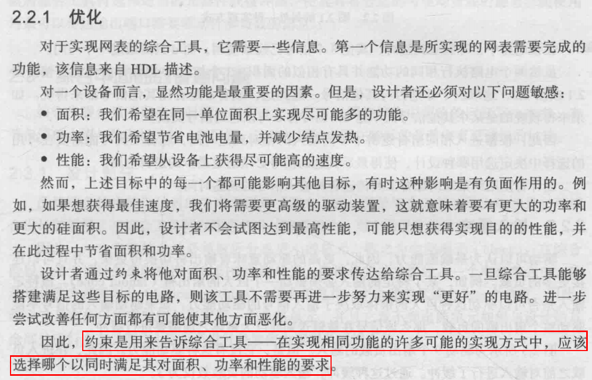

# 综合与时序分析的设计约束

David Wang阅读书籍[**《综合与时序分析的设计约束》**](https://book.douban.com/subject/30318179/)的读书笔记   
据网络评论，该书十分重要，IC人必读书之一，内容精致且连贯，推荐一口气读完。

### **2. 综合基础知识**

#### **2.1 综合简介**

    

#### **2.2 时序约束在综合中的作用**

### **3. 时序分析与约束**

### **4. TCL扩展SDC**